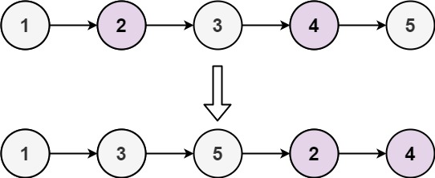
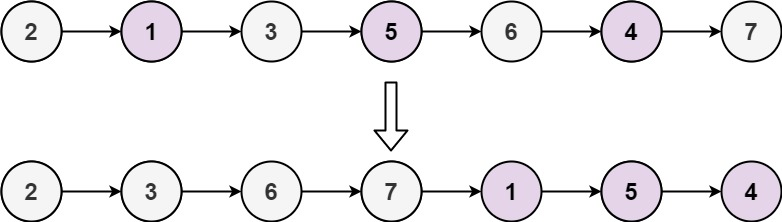

### [328. 奇偶链表](https://leetcode.cn/problems/odd-even-linked-list/)
给定单链表的头节点 head ，将所有索引为奇数的节点和索引为偶数的节点分别组合在一起，然后返回重新排序的列表。

第一个节点的索引被认为是 奇数 ， 第二个节点的索引为 偶数 ，以此类推。

请注意，偶数组和奇数组内部的相对顺序应该与输入时保持一致。

你必须在 O(1) 的额外空间复杂度和 O(n) 的时间复杂度下解决这个问题。


##### 示例 1:

```
输入: head = [1,2,3,4,5]
输出: [1,3,5,2,4]
```

##### 示例 2:

```
输入: head = [2,1,3,5,6,4,7]
输出: [2,3,6,7,1,5,4]
```

##### 提示:
- n ==  链表中的节点数
- 0 <= n <= 10<sup>4</sup>
- -10<sup>6</sup> <= Node.val <= 10<sup>6</sup>

##### 题解：
```rust
impl Solution {
    pub fn odd_even_list(mut head: Option<Box<ListNode>>) -> Option<Box<ListNode>> {
        let mut odd_head = Box::new(ListNode::new(0));
        let mut even_head = Box::new(ListNode::new(0));
        let mut odd = odd_head.as_mut();
        let mut even = even_head.as_mut();

        let mut is_even = false;
        while let Some(mut node) = head {
            head = node.next.take();

            if is_even {
                even.next = Some(node);
                
                if let Some(ref mut next) = even.next {
                    even = next;
                }
            } else {
                odd.next = Some(node);

                if let Some(ref mut next) = odd.next {
                    odd = next;
                }
            }

            is_even = !is_even;
        }

        odd.next = even_head.next;
        odd_head.next
    }
}
```
