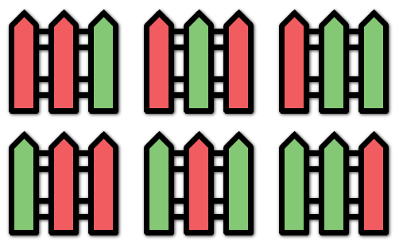

### [276. 栅栏涂色](https://leetcode.cn/problems/paint-fence/)
有 k 种颜色的涂料和一个包含 n 个栅栏柱的栅栏，请你按下述规则为栅栏设计涂色方案：

每个栅栏柱可以用其中 一种 颜色进行上色。
相邻的栅栏柱 最多连续两个 颜色相同。
给你两个整数 k 和 n ，返回所有有效的涂色 方案数 。


##### 示例 1：

```
输入：n = 3, k = 2
输出：6
解释：所有的可能涂色方案如上图所示。注意，全涂红或者全涂绿的方案属于无效方案，因为相邻的栅栏柱 最多连续两个 颜色相同。
```

##### 示例 2：
```
输入：n = 1, k = 1
输出：1
```

##### 示例 3：
```
输入：n = 7, k = 2
输出：42
```

##### 提示：
- 1 <= n <= 50
- 1 <= k <= 10<sup>5</sup>
- 题目数据保证：对于输入的 n 和 k ，其答案在范围 [0, 2<sup>31</sup> - 1] 内

##### 题解：
```rust
impl Solution {
    pub fn num_ways(n: i32, k: i32) -> i32 {
        let n = n as usize;
        let mut dp = vec![vec![0; 2]; n];

        dp[0][0] = 0;
        dp[0][1] = k;

        for i in 1..n {
            dp[i][0] = dp[i-1][1];
            dp[i][1] = dp[i-1][0] * (k - 1) + dp[i-1][1] * (k - 1);
        }

        dp[n - 1][0] + dp[n - 1][1]
    }
}
```
