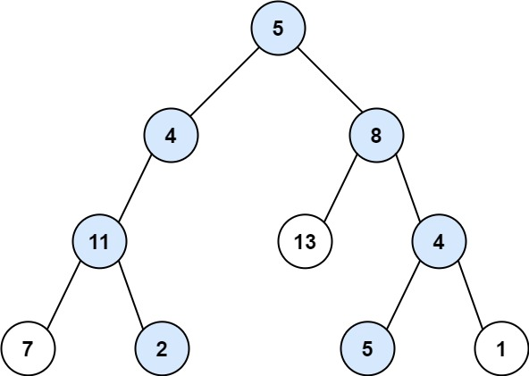

### [113. 路径总和 II](https://leetcode.cn/problems/path-sum-ii/)

给你二叉树的根节点 root 和一个整数目标和 targetSum ，找出所有 从根节点到叶子节点 路径总和等于给定目标和的路径。

叶子节点 是指没有子节点的节点。


##### 示例 1：

```
输入：root = [5,4,8,11,null,13,4,7,2,null,null,5,1], targetSum = 22
输出：[[5,4,11,2],[5,8,4,5]]
```

##### 示例 2：

```
输入：root = [1,2,3], targetSum = 5
输出：[]
```

##### 示例 3：
```
输入：root = [1,2], targetSum = 0
输出：[]
```

##### 提示：
- 树中节点总数在范围 [0, 5000] 内
- -1000 <= Node.val <= 1000
- -1000 <= targetSum <= 1000

##### 题解：
```rust
use std::rc::Rc;
use std::cell::RefCell;
impl Solution {
    pub fn path_sum(root: Option<Rc<RefCell<TreeNode>>>, target_sum: i32) -> Vec<Vec<i32>> {
        let mut ans = vec![];
        Self::dfs(&root, target_sum, &mut ans, &mut Vec::new());
        ans
    }

    fn dfs(root: &Option<Rc<RefCell<TreeNode>>>, mut target_sum: i32, ans: &mut Vec<Vec<i32>>, selected: &mut Vec<i32>) {
        if let Some(r) = root {
            target_sum -= r.borrow().val;
            selected.push(r.borrow().val);

            if r.borrow().left.is_none() && r.borrow().right.is_none() && target_sum == 0 {
                ans.push(selected.to_vec());
            }

            Self::dfs(&r.borrow().left, target_sum, ans, selected);
            Self::dfs(&r.borrow().right, target_sum, ans, selected);
            selected.pop();
        }
    }
}
```

`回溯`
