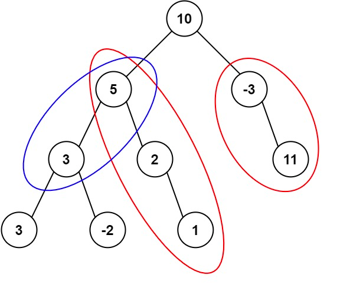

### [437. 路径总和 III](https://leetcode.cn/problems/path-sum-iii/)
给定一个二叉树的根节点 root ，和一个整数 targetSum ，求该二叉树里节点值之和等于 targetSum 的 路径 的数目。

路径 不需要从根节点开始，也不需要在叶子节点结束，但是路径方向必须是向下的（只能从父节点到子节点）。


##### 示例 1：

```
输入：root = [10,5,-3,3,2,null,11,3,-2,null,1], targetSum = 8
输出：3
解释：和等于 8 的路径有 3 条，如图所示。
```

##### 示例 2：
```
输入：root = [5,4,8,11,null,13,4,7,2,null,null,5,1], targetSum = 22
输出：3
```

##### 提示:
- 二叉树的节点个数的范围是 [0,1000]
- -10<sup>9</sup> <= Node.val <= 10<sup>9</sup>
- -1000 <= targetSum <= 1000 

##### 题解：
```rust
use std::rc::Rc;
use std::cell::RefCell;
use std::collections::HashMap;
impl Solution {
    pub fn path_sum(root: Option<Rc<RefCell<TreeNode>>>, target_sum: i32) -> i32 {
        let mut mp = HashMap::new();
        mp.insert(0, 1);

        Self::count(&root, target_sum as i64, &mut mp, 0)
    }

    fn count(root: &Option<Rc<RefCell<TreeNode>>>, target_sum: i64, prefix_sum: &mut HashMap<i64, i32>, cur_sum: i64) -> i32 {
        if let Some(r) = root {
            let mut ans = 0;
            let cur_sum = cur_sum + r.borrow().val as i64;
            ans += if let Some(&v) = prefix_sum.get(&(cur_sum - target_sum)) { v } else { 0 };

            *prefix_sum.entry(cur_sum).or_insert(0) += 1;

            ans += Self::count(&r.borrow().left, target_sum, prefix_sum, cur_sum);
            ans += Self::count(&r.borrow().right, target_sum, prefix_sum, cur_sum);

            *prefix_sum.entry(cur_sum).or_insert(0) -= 1;

            ans
        } else {
            0
        }
    }
}
```
