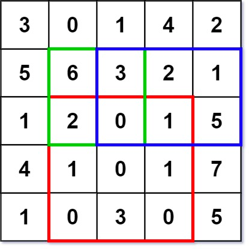

### [304. 二维区域和检索 - 矩阵不可变](https://leetcode.cn/problems/range-sum-query-2d-immutable/)
给定一个二维矩阵 matrix，以下类型的多个请求：

计算其子矩形范围内元素的总和，该子矩阵的 左上角 为 (row1, col1) ，右下角 为 (row2, col2) 。
实现 NumMatrix 类：

NumMatrix(int[][] matrix) 给定整数矩阵 matrix 进行初始化
int sumRegion(int row1, int col1, int row2, int col2) 返回 左上角 (row1, col1) 、右下角 (row2, col2) 所描述的子矩阵的元素 总和 。


##### 示例 1：

```
输入:
["NumMatrix","sumRegion","sumRegion","sumRegion"]
[[[[3,0,1,4,2],[5,6,3,2,1],[1,2,0,1,5],[4,1,0,1,7],[1,0,3,0,5]]],[2,1,4,3],[1,1,2,2],[1,2,2,4]]
输出:
[null, 8, 11, 12]

解释:
NumMatrix numMatrix = new NumMatrix([[3,0,1,4,2],[5,6,3,2,1],[1,2,0,1,5],[4,1,0,1,7],[1,0,3,0,5]]);
numMatrix.sumRegion(2, 1, 4, 3); // return 8 (红色矩形框的元素总和)
numMatrix.sumRegion(1, 1, 2, 2); // return 11 (绿色矩形框的元素总和)
numMatrix.sumRegion(1, 2, 2, 4); // return 12 (蓝色矩形框的元素总和)
```

##### 提示：
- m == matrix.length
- n == matrix[i].length
- 1 <= m, n <= 200
- -10<sup>5</sup> <= matrix[i][j] <= 10<sup>5</sup>
- 0 <= row1 <= row2 < m
- 0 <= col1 <= col2 < n
- 最多调用 10<sup>4</sup> 次 sumRegion 方法

##### 题解：
```rust
struct NumMatrix {
    sum: Vec<Vec<i32>>,
}

impl NumMatrix {

    fn new(matrix: Vec<Vec<i32>>) -> Self {
        let n = matrix.len();
        let m = matrix[0].len();
        let mut sum = vec![vec![0;m+1];n+1];
        for i in 0..n {
            for j in 0..m {
                sum[i+1][j+1] = sum[i+1][j] + sum[i][j+1] - sum[i][j] + matrix[i][j];
            }
        }

        Self {
            sum,
        }
    }
    
    fn sum_region(&self, row1: i32, col1: i32, row2: i32, col2: i32) -> i32 {
        let r1 = row1 as usize;
        let r2 = row2 as usize;
        let c1 = col1 as usize;
        let c2 = col2 as usize;
        let sum = &self.sum;

        sum[r2+1][c2+1] - sum[r2+1][c1] - sum[r1][c2+1] + sum[r1][c1]
    }
}

```
