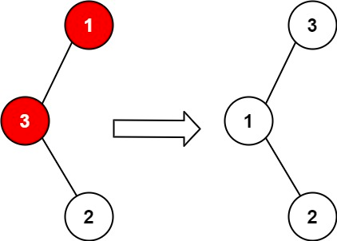
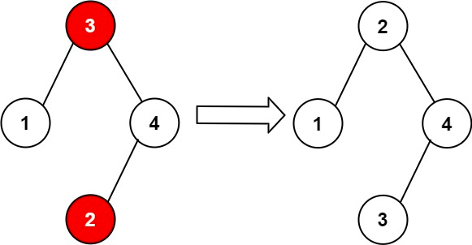

### [99. 恢复二叉搜索树](https://leetcode.cn/problems/recover-binary-search-tree/)

给你二叉搜索树的根节点 root ，该树中的 恰好 两个节点的值被错误地交换。请在不改变其结构的情况下，恢复这棵树 。


##### 示例 1：

```
输入：root = [1,3,null,null,2]
输出：[3,1,null,null,2]
解释：3 不能是 1 的左孩子，因为 3 > 1 。交换 1 和 3 使二叉搜索树有效。
```

##### 示例 2：

```
输入：root = [3,1,4,null,null,2]
输出：[2,1,4,null,null,3]
解释：2 不能在 3 的右子树中，因为 2 < 3 。交换 2 和 3 使二叉搜索树有效。
```

##### 提示：
- 树上节点的数目在范围 [2, 1000] 内
- -2<sup>31</sup> <= Node.val <= 2<sup>31</sup> - 1


##### 进阶：
- 使用 O(n) 空间复杂度的解法很容易实现。你能想出一个只使用 O(1) 空间的解决方案吗？

##### 题解：
```rust
use std::rc::Rc;
use std::cell::RefCell;
use std::mem::swap;

impl Solution {
    pub fn recover_tree(root: &mut Option<Rc<RefCell<TreeNode>>>) {
        let mut stack = vec![];
        let mut cur = root.clone();
        let mut left = None;
        let mut right = None;
        let mut prev: Option<Rc<RefCell<TreeNode>>> = None;

        while !stack.is_empty() || cur.is_some() {
            while let Some(node) = cur {
                cur = node.borrow_mut().left.clone();
                stack.push(node);
            }

            if let Some(node) = stack.pop() {
                if let Some(p) = prev {
                    if p.borrow_mut().val > node.borrow_mut().val {
                        right = Some(node.clone());

                        if left.is_none() {
                            left = Some(p);
                        } else {
                            break;
                        }
                    }
                }

                prev = Some(node.clone());
                cur = node.borrow_mut().right.clone();
            }
        }

        swap(&mut left.unwrap().borrow_mut().val, &mut right.unwrap().borrow_mut().val)
    }
}
```

`深度优先搜索`
