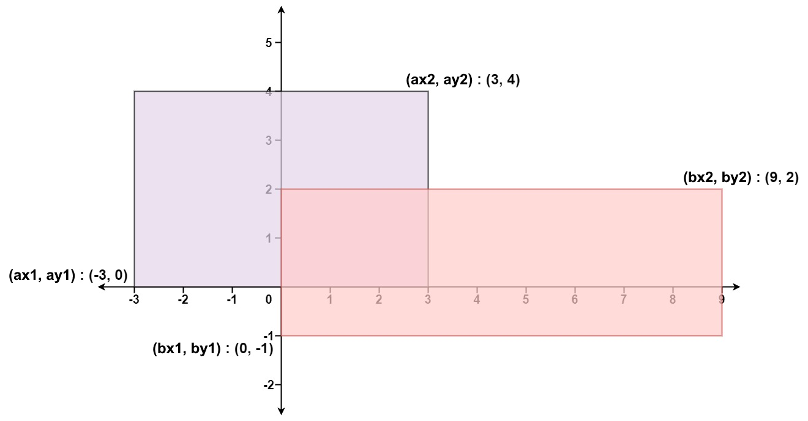

### [223. 矩形面积](https://leetcode.cn/problems/rectangle-area/)
给你 二维 平面上两个 由直线构成且边与坐标轴平行/垂直 的矩形，请你计算并返回两个矩形覆盖的总面积。

每个矩形由其 左下 顶点和 右上 顶点坐标表示：

第一个矩形由其左下顶点 (ax1, ay1) 和右上顶点 (ax2, ay2) 定义。
第二个矩形由其左下顶点 (bx1, by1) 和右上顶点 (bx2, by2) 定义。


##### 示例 1：

```
Rectangle Area
输入：ax1 = -3, ay1 = 0, ax2 = 3, ay2 = 4, bx1 = 0, by1 = -1, bx2 = 9, by2 = 2
输出：45
```

##### 示例 2：
```
输入：ax1 = -2, ay1 = -2, ax2 = 2, ay2 = 2, bx1 = -2, by1 = -2, bx2 = 2, by2 = 2
输出：16
```

##### 提示：
- -10<sup>4</sup> <= ax1, ay1, ax2, ay2, bx1, by1, bx2, by2 <= 10<sup>4</sup>

##### 题解：
```rust
impl Solution {
    pub fn compute_area(ax1: i32, ay1: i32, ax2: i32, ay2: i32, bx1: i32, by1: i32, bx2: i32, by2: i32) -> i32 {
        let left = ax1.max(bx1);
        let right = ax2.min(bx2);
        let bottom = ay1.max(by1);
        let top = ay2.min(by2);

        let r1 = (ax2 - ax1) * (ay2 - ay1);
        let r2 = (bx2 - bx1) * (by2 - by1);
        let r3 = (right.max(left) - left) * (top.max(bottom) - bottom);

        r1 + r2 - r3
    }
}
```
