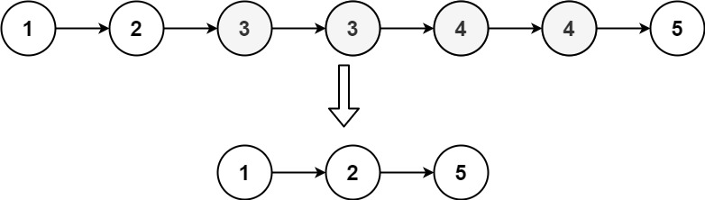
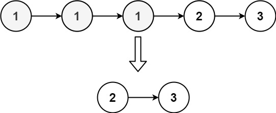

### 82. 删除排序链表中的重复元素 II

给定一个已排序的链表的头 head ， 删除原始链表中所有重复数字的节点，只留下不同的数字 。返回 已排序的链表 。


##### 示例 1：

```
输入：head = [1,2,3,3,4,4,5]
输出：[1,2,5]
```

##### 示例 2：

```
输入：head = [1,1,1,2,3]
输出：[2,3]
```

##### 提示：
- 链表中节点数目在范围 [0, 300] 内
- -100 <= Node.val <= 100
- 题目数据保证链表已经按升序 排列

##### 题解：
```rust
impl Solution {
    pub fn delete_duplicates(head: Option<Box<ListNode>>) -> Option<Box<ListNode>> {
        match head {
            None => None,
            Some(mut h) => match h.next {
                None => Some(h),
                Some(mut n) => {
                    if h.val != n.val {
                        h.next = Self::delete_duplicates(Some(n));
                        Some(h)
                    } else {
                        while n.val == h.val {
                            match n.next {
                                None => return None,
                                Some(nn) => n = nn,
                            };
                        }

                        Self::delete_duplicates(Some(n))
                    }
                }
            }
        }
    }
}
```

`链表` `双指针`
