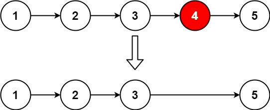

### [19. 删除链表的倒数第 N 个结点](https://leetcode.cn/problems/remove-nth-node-from-end-of-list/)

给你一个链表，删除链表的倒数第 n 个结点，并且返回链表的头结点。

##### 示例 1：

```
输入：head = [1,2,3,4,5], n = 2
输出：[1,2,3,5]
```

##### 示例 2：
```
输入：head = [1], n = 1
输出：[]
```

##### 示例 3：
```
输入：head = [1,2], n = 1
输出：[1]
```

##### 提示：
- 链表中结点的数目为 sz
- 1 <= sz <= 30
- 0 <= Node.val <= 100
- 1 <= n <= sz

**进阶：** 你能尝试使用一趟扫描实现吗？

##### 题解：
```rust
impl Solution {
    pub fn remove_nth_from_end(head: Option<Box<ListNode>>, n: i32) -> Option<Box<ListNode>> {
        let mut dummy = ListNode::new(0);
        dummy.next = head;
        let mut dummy = Box::new(dummy);

        Self::travel(&mut dummy, n);

        dummy.next
    }

    fn travel(cur: &mut Box<ListNode>, n : i32) -> i32 {
        if let Some(child) = cur.next.as_mut() {
            let num = 1 + Self::travel(child, n);

            if num == n {
                cur.next = child.next.take();
            }

            return num
        }

        0
    }
}
```

`链表` `递归`
