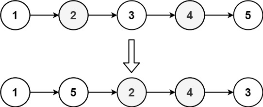

### [143. 重排链表](https://leetcode.cn/problems/reorder-list/)
给定一个单链表 L 的头节点 head ，单链表 L 表示为：
```
L0 → L1 → … → Ln - 1 → Ln
```

请将其重新排列后变为：
```
L0 → Ln → L1 → Ln - 1 → L2 → Ln - 2 → …
```
不能只是单纯的改变节点内部的值，而是需要实际的进行节点交换。


##### 示例 1：

```
输入：head = [1,2,3,4]
输出：[1,4,2,3]
```

##### 示例 2：

```
输入：head = [1,2,3,4,5]
输出：[1,5,2,4,3]
```

##### 提示：
- 链表的长度范围为 [1, 5 * 104]
- 1 <= node.val <= 1000

##### 题解：
```rust
impl Solution {
    pub fn reorder_list(head: &mut Option<Box<ListNode>>) {
        let mut vec = std::collections::VecDeque::new();
        let mut p = head.take();

        while let Some(mut n) = p {
            p = n.next.take();
            vec.push_back(n);
        }

        let mut dummy = Some(Box::new(ListNode::new(0)));
        let mut p = dummy.as_mut();

        while vec.len() > 0 {
            p.as_mut().unwrap().next = vec.pop_front();
            p = p.unwrap().next.as_mut();
            p.as_mut().unwrap().next = vec.pop_back();
            p = p.unwrap().next.as_mut();
        }

        *head = dummy.unwrap().next;
    }
}
```
