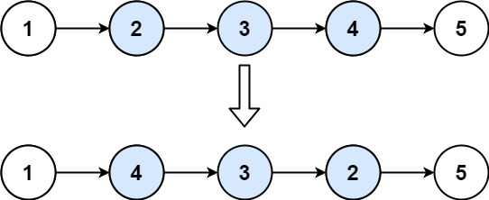

### [92. 反转链表 II](https://leetcode.cn/problems/reverse-linked-list-ii/)

给你单链表的头指针 head 和两个整数 left 和 right ，其中 left <= right 。请你反转从位置 left 到位置 right 的链表节点，返回 反转后的链表 。


##### 示例 1：

```
输入：head = [1,2,3,4,5], left = 2, right = 4
输出：[1,4,3,2,5]
```

##### 示例 2：
```
输入：head = [5], left = 1, right = 1
输出：[5]
```

##### 提示：

链表中节点数目为 n
- 1 <= n <= 500
- -500 <= Node.val <= 500
- 1 <= left <= right <= n


##### 进阶： 
- 你可以使用一趟扫描完成反转吗？

##### 题解：
```rust
impl Solution {
    pub fn reverse_between(mut head: Option<Box<ListNode>>, left: i32, right: i32) -> Option<Box<ListNode>> {
        let mut p1 = (1..left).fold(&mut head, |p, _| {
            &mut p.as_mut().unwrap().next
        });

        let mut p2 = p1.take();
        let mut p3 = (left..=right).fold(&mut p2, |p, _| {
            &mut p.as_mut().unwrap().next
        });

        let mut p4 = p3.take();

        while let Some(mut p) = p2 {
            p2 = p.next.take();
            p.next = p4;
            p4 = Some(p);
        }

        *p1 = p4;

        head
    }
}
```

`链表`
