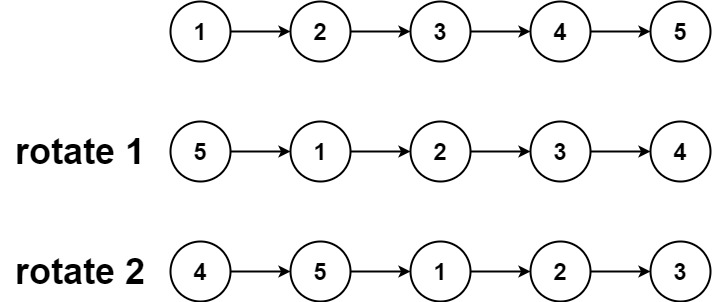

### [61. 旋转链表](https://leetcode.cn/problems/rotate-list/)

给你一个链表的头节点 head ，旋转链表，将链表每个节点向右移动 k 个位置。

##### 示例 1：

```
输入：head = [1,2,3,4,5], k = 2
输出：[4,5,1,2,3]
```

##### 示例 2：

```
输入：head = [0,1,2], k = 4
输出：[2,0,1]
```

##### 提示：
- 链表中节点的数目在范围 [0, 500] 内
- -100 <= Node.val <= 100
- 0 <= k <= 2 * 10<sup>9</sup>

##### 题解：
```rust
impl Solution {
    pub fn rotate_right(mut head: Option<Box<ListNode>>, k: i32) -> Option<Box<ListNode>> {
        if head.is_none() || k == 0 {
            return head;
        }

        let mut len = 0;
        let mut cur = head.as_ref();

        while let Some(n) = cur {
            len += 1;
            cur = n.next.as_ref();
        }

        if k == len {
            return head;
        }

        let mut k = len - k % len;
        let mut cur = head.as_mut();
        let mut tail = None;

        while let Some(n) = cur {
            if k == 1 {
                tail = n.next.take();
                break;
            }
            cur = n.next.as_mut();
            k -= 1;
        }

        if tail.is_none() {
            return head;
        }

        let mut cur = tail.as_mut();

        while let Some(n) = cur {
            if n.next.is_none() {
                n.next = head;
                break;
            }
            cur = n.next.as_mut();
        }

        tail
    }
}
```

`链表`
