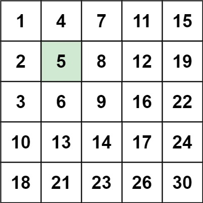

### [240. 搜索二维矩阵 II](https://leetcode.cn/problems/search-a-2d-matrix-ii/)
编写一个高效的算法来搜索 m x n 矩阵 matrix 中的一个目标值 target 。该矩阵具有以下特性：

每行的元素从左到右升序排列。
每列的元素从上到下升序排列。


##### 示例 1：

```
输入：matrix = [[1,4,7,11,15],[2,5,8,12,19],[3,6,9,16,22],[10,13,14,17,24],[18,21,23,26,30]], target = 5
输出：true
```

##### 示例 2：

```
输入：matrix = [[1,4,7,11,15],[2,5,8,12,19],[3,6,9,16,22],[10,13,14,17,24],[18,21,23,26,30]], target = 20
输出：false
```

##### 提示：
- m == matrix.length
- n == matrix[i].length
- 1 <= n, m <= 300
- -10<sup>9</sup> <= matrix[i][j] <= 10<sup>9</sup>
- 每行的所有元素从左到右升序排列
- 每列的所有元素从上到下升序排列
- -10<sup>9</sup> <= target <= 10<sup>9</sup>

##### 提示：
```rust
impl Solution {
    pub fn search_matrix(matrix: Vec<Vec<i32>>, target: i32) -> bool {
        let n = matrix.len() - 1;
        let m = matrix[0].len() - 1;

        let mut i = 0;
        let mut j = m;

        while i <= n && j >= 0 && j <= m {
            if matrix[i][j] == target {
                return true;
            }

            if matrix[i][j] > target {
                j -= 1;
            } else {
                i += 1;
            }
        }

        false
    }
}
```
