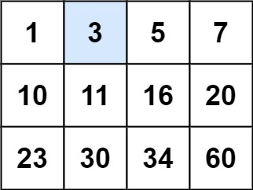
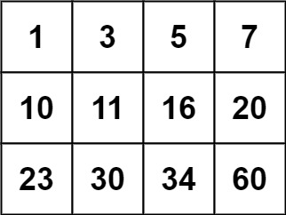

### [74. 搜索二维矩阵](https://leetcode.cn/problems/search-a-2d-matrix/)

编写一个高效的算法来判断 m x n 矩阵中，是否存在一个目标值。该矩阵具有如下特性：

- 每行中的整数从左到右按升序排列。
- 每行的第一个整数大于前一行的最后一个整数。

##### 示例 1：

```
输入：matrix = [[1,3,5,7],[10,11,16,20],[23,30,34,60]], target = 3
输出：true
```

##### 示例 2：

```
输入：matrix = [[1,3,5,7],[10,11,16,20],[23,30,34,60]], target = 13
输出：false
```

##### 提示：
- m == matrix.length
- n == matrix[i].length
- 1 <= m, n <= 100
- -10<sup>4</sup> <= matrix[i][j], target <= 10<sup>4</sup>


##### 题解：
```rust
impl Solution {
    pub fn search_matrix(matrix: Vec<Vec<i32>>, target: i32) -> bool {
        let row = matrix.len();
        let col = matrix[0].len();
        let mut i = 0;
        let mut j = row * col - 1;

        while i <= j {
            let m = i + (j - i) / 2;
            let v = matrix[m / col][m % col];

            if v == target {
                return true;
            }

            if v < target {
                i = m + 1;
            } else {
                if m == 0 {
                    return false;
                }

                j = m - 1;
            }
        }

        false
    }
}
```

`二分查找`
