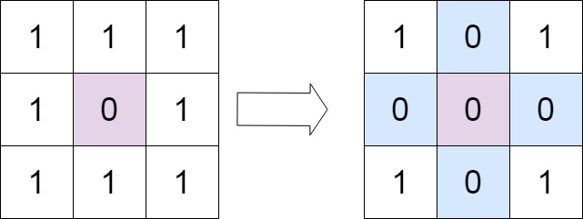

### [73. 矩阵置零](https://leetcode.cn/problems/set-matrix-zeroes/)

给定一个 m x n 的矩阵，如果一个元素为 0 ，则将其所在行和列的所有元素都设为 0 。请使用 原地 算法。

##### 示例 1：

```
输入：matrix = [[1,1,1],[1,0,1],[1,1,1]]
输出：[[1,0,1],[0,0,0],[1,0,1]]
```

##### 示例 2：

```
输入：matrix = [[0,1,2,0],[3,4,5,2],[1,3,1,5]]
输出：[[0,0,0,0],[0,4,5,0],[0,3,1,0]]
```

##### 提示：
- m == matrix.length
- n == matrix[0].length
- 1 <= m, n <= 200
- -231 <= matrix[i][j] <= 231 - 1

##### 进阶：
- 一个直观的解决方案是使用  O(mn) 的额外空间，但这并不是一个好的解决方案。
- 一个简单的改进方案是使用 O(m + n) 的额外空间，但这仍然不是最好的解决方案。
- 你能想出一个仅使用常量空间的解决方案吗？

##### 题解：
```rust
impl Solution {
    pub fn set_zeroes(matrix: &mut Vec<Vec<i32>>) {
        let n = matrix.len();
        let m = matrix[0].len();

        let mut col = false;

        for i in 0..n {
            if matrix[i][0] == 0 {
                col = true;
            }

            for j in 1..m {
                if matrix[i][j] == 0 {
                    matrix[i][0] = 0;
                    matrix[0][j] = 0;
                }
            }
        }

        for i in (0..n).rev() {
            for j in 1..m {
                if matrix[i][0] == 0 || matrix[0][j] == 0 {
                    matrix[i][j] = 0;
                }
            }

            if col {
                matrix[i][0] = 0;
            }
        }
    }
}
```

`哈希`
