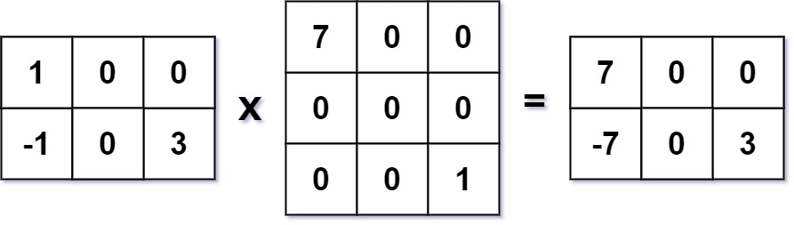

### [311. 稀疏矩阵的乘法](https://leetcode.cn/problems/sparse-matrix-multiplication/)
给定两个 稀疏矩阵 ：大小为 m x k 的稀疏矩阵 mat1 和大小为 k x n 的稀疏矩阵 mat2 ，返回 mat1 x mat2 的结果。你可以假设乘法总是可能的。


##### 示例 1：

```
输入：mat1 = [[1,0,0],[-1,0,3]], mat2 = [[7,0,0],[0,0,0],[0,0,1]]
输出：[[7,0,0],[-7,0,3]]
```

##### 示例 2:
```
输入：mat1 = [[0]], mat2 = [[0]]
输出：[[0]]
```

##### 提示:
- m == mat1.length
- k == mat1[i].length == mat2.length
- n == mat2[i].length
- 1 <= m, n, k <= 100
- -100 <= mat1[i][j], mat2[i][j] <= 100

##### 题解：
```rust
impl Solution {
    pub fn multiply(mat1: Vec<Vec<i32>>, mat2: Vec<Vec<i32>>) -> Vec<Vec<i32>> {
        let n = mat1.len();
        let m = mat2[0].len();
        let r = mat1[0].len();
        let mut ans = vec![vec![0;m];n];

        for i in 0..n {
            for j in 0..r {
                if mat1[i][j] != 0 {
                    for k in 0..m {
                        ans[i][k] += mat1[i][j] * mat2[j][k];
                    }
                }
            }
        }

        ans
    }
}
```
