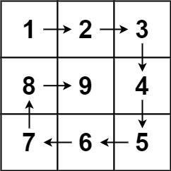

### [59. 螺旋矩阵 II](https://leetcode.cn/problems/spiral-matrix-ii/)

给你一个正整数 n ，生成一个包含 1 到 n2 所有元素，且元素按顺时针顺序螺旋排列的 n x n 正方形矩阵 matrix 。

##### 示例 1：

```
输入：n = 3
输出：[[1,2,3],[8,9,4],[7,6,5]]
```

##### 示例 2：
```
输入：n = 1
输出：[[1]]
```

##### 提示：
- 1 <= n <= 20

##### 题解：
```rust
impl Solution {
    pub fn generate_matrix(n: i32) -> Vec<Vec<i32>> {
        let mut matrix = vec![vec![0;n as usize];n as usize];
        let mut top = 0_usize;
        let mut right = n as usize - 1;
        let mut left = 0_usize;
        let mut bottom = n as usize - 1;
        let max = n * n;
        let mut num = 1;

        if n == 1 {
            return vec![vec![1]];
        }

        while num <= max {
            for i in left..=right {
                matrix[left][i] = num;
                num += 1;
            }
            top += 1;

            for i in top..=bottom {
                matrix[i][right] = num;
                num += 1;
            }
            right -= 1;

            for i in (left..=right).rev() {
                matrix[bottom][i] = num;
                num += 1;
            }
            bottom -= 1;

            for i in (top..=bottom).rev() {
                matrix[i][left] = num;
                num += 1;
            }
            left += 1;
        }

        matrix
    }
}
```

`矩阵`
