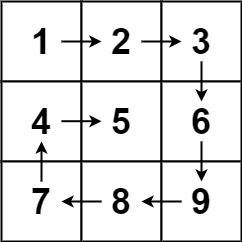

### [54. 螺旋矩阵](https://leetcode.cn/problems/spiral-matrix/)

给你一个 m 行 n 列的矩阵 matrix ，请按照 顺时针螺旋顺序 ，返回矩阵中的所有元素。

##### 示例 1：

```
输入：matrix = [[1,2,3],[4,5,6],[7,8,9]]
输出：[1,2,3,6,9,8,7,4,5]
```

##### 示例 2：

```
输入：matrix = [[1,2,3,4],[5,6,7,8],[9,10,11,12]]
输出：[1,2,3,4,8,12,11,10,9,5,6,7]
```

##### 提示：
- m == matrix.length
- n == matrix[i].length
- 1 <= m, n <= 10
- -100 <= matrix[i][j] <= 100

##### 题解：
```rust
impl Solution {
    pub fn spiral_order(matrix: Vec<Vec<i32>>) -> Vec<i32> {
        let mut n = matrix.len();
        let mut m = matrix[0].len();
        let mut top = 0;
        let mut right = m - 1;
        let mut left = 0;
        let mut bottom = n - 1;
        let mut ans = vec![];

        for _ in 0..n*m {
            if left > right || right > m {
                break;
            }

            for j in left..=right {
                ans.push(matrix[top][j]);
            }
            top += 1;

            if top > bottom || bottom > n {
                break;
            }

            for i in top..=bottom {
                ans.push(matrix[i][right]);
            }
            right -= 1;

            if left > right || right > m {
                break;
            }

            for j in (left..=right).rev() {
                ans.push(matrix[bottom][j]);
            }
            bottom -= 1;

            if top > bottom || bottom > n {
                break;
            }

            for i in (top..=bottom).rev() {
                ans.push(matrix[i][left]);
            }
            left += 1;
        }

        ans
    }
}
```

`矩阵`
