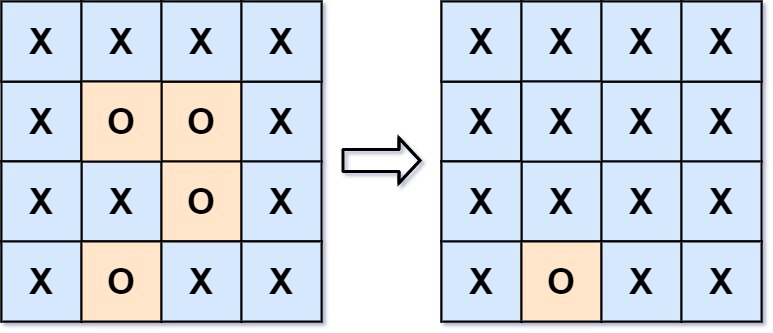

### [130. 被围绕的区域](https://leetcode.cn/problems/surrounded-regions/)

给你一个 m x n 的矩阵 board ，由若干字符 'X' 和 'O' ，找到所有被 'X' 围绕的区域，并将这些区域里所有的 'O' 用 'X' 填充。


##### 示例 1：

```
输入：board = [["X","X","X","X"],["X","O","O","X"],["X","X","O","X"],["X","O","X","X"]]
输出：[["X","X","X","X"],["X","X","X","X"],["X","X","X","X"],["X","O","X","X"]]
解释：被围绕的区间不会存在于边界上，换句话说，任何边界上的 'O' 都不会被填充为 'X'。 任何不在边界上，或不与边界上的 'O' 相连的 'O' 最终都会被填充为 'X'。如果两个元素在水平或垂直方向相邻，则称它们是“相连”的。
```

##### 示例 2：
```
输入：board = [["X"]]
输出：[["X"]]
```

##### 提示：
- m == board.length
- n == board[i].length
- 1 <= m, n <= 200
- board[i][j] 为 'X' 或 'O'

##### 题解：
```rust
impl Solution {
    pub fn solve(board: &mut Vec<Vec<char>>) {
        let n = board.len();
        let m = board[0].len();

        for i in 0..n {
            Self::dfs(board, i, 0, n, m);
            Self::dfs(board, i , m - 1, n, m);
        }

        for j in 1..m-1 {
            Self::dfs(board, 0, j, n, m);
            Self::dfs(board, n - 1, j, n, m);
        }

        for i in 0..n {
            for j in 0..m {
                if board[i][j] == 'R' {
                    board[i][j] = 'O';
                } else if board[i][j] == 'O' {
                    board[i][j] = 'X';
                }
            }
        }
    }

    fn dfs(board: &mut Vec<Vec<char>>, i: usize, j: usize, n: usize, m: usize) {
        if i < n && j < m && board[i][j] == 'O' {
            board[i][j] = 'R';
            Self::dfs(board, i-1, j, n, m);
            Self::dfs(board, i+1, j, n, m);
            Self::dfs(board, i, j-1, n, m);
            Self::dfs(board, i, j+1, n, m);
        }
    }
}
```
