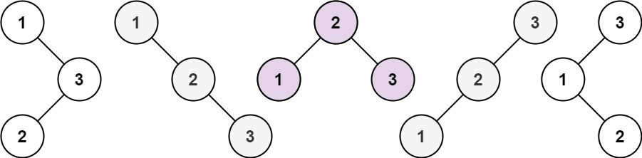

### [95. 不同的二叉搜索树 II](https://leetcode.cn/problems/unique-binary-search-trees-ii/)

给你一个整数 n ，请你生成并返回所有由 n 个节点组成且节点值从 1 到 n 互不相同的不同 二叉搜索树 。可以按 任意顺序 返回答案。


##### 示例 1：

```
输入：n = 3
输出：[[1,null,2,null,3],[1,null,3,2],[2,1,3],[3,1,null,null,2],[3,2,null,1]]
```

##### 示例 2：
```
输入：n = 1
输出：[[1]]
```

##### 提示：
- 1 <= n <= 8

##### 题解:
```rust
use std::rc::Rc;
use std::cell::RefCell;

macro_rules! tree {
    ($v:expr) => {
        Some(Rc::new(RefCell::new(TreeNode {
            val: $v,
            left: None,
            right: None,
        })))
    };
    ($v:expr, $l:expr, $r:expr) => {
        Some(Rc::new(RefCell::new(TreeNode {
            val: $v,
            left: $l,
            right: $r,
        })))
    };
}

impl Solution {
    pub fn generate_trees(n: i32) -> Vec<Option<Rc<RefCell<TreeNode>>>> {
        if n == 0 {
            return Vec::new()
        }

        Self::generate(1, n)
    }

    fn generate(start: i32, end: i32) -> Vec<Option<Rc<RefCell<TreeNode>>>> {
        if start > end {
            return vec![None];
        }

        let mut ans = vec![];

        for i in start..=end {
            let mut left = Self::generate(start, i - 1);
            let mut right = Self::generate(i + 1, end);

            for left_node in left.iter() {
                for right_node in right.iter() {
                    ans.push(tree!(i, left_node.clone(), right_node.clone()));
                }
            }
        }

        ans
    }
}
```
