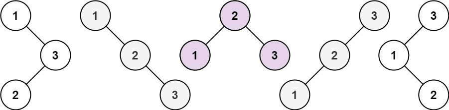

### [96. 不同的二叉搜索树](https://leetcode.cn/problems/unique-binary-search-trees/)

给你一个整数 n ，求恰由 n 个节点组成且节点值从 1 到 n 互不相同的 二叉搜索树 有多少种？返回满足题意的二叉搜索树的种数。


##### 示例 1：

```
输入：n = 3
输出：5
```

##### 示例 2：
```
输入：n = 1
输出：1
```

##### 提示：
- 1 <= n <= 19

##### 题解：
```rust
impl Solution {
    pub fn num_trees(n: i32) -> i32 {
        (0..n as i64).fold(1, |c, i| c * 2 * (2 * i + 1) / (i + 2)) as i32
    }
}
```
`数学`

```rust
impl Solution {
    pub fn num_trees(n: i32) -> i32 {
        let mut dp = vec![0;n as usize+1];
        dp[0] = 1;
        dp[1] = 1;

        for i in 2..=n as usize {
            for j in 1..=i {
                dp[i] += dp[j-1] * dp[i-j];
            }
        }

        dp[n as usize]
    }
}
```

`动态规划`
