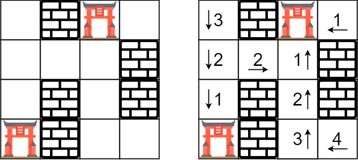

### [286. 墙与门](https://leetcode.cn/problems/walls-and-gates/)
你被给定一个 m × n 的二维网格 rooms ，网格中有以下三种可能的初始化值：

-1 表示墙或是障碍物
0 表示一扇门
INF 无限表示一个空的房间。然后，我们用 231 - 1 = 2147483647 代表 INF。你可以认为通往门的距离总是小于 2147483647 的。
你要给每个空房间位上填上该房间到 最近门的距离 ，如果无法到达门，则填 INF 即可。


##### 示例 1：

```
输入：rooms = [[2147483647,-1,0,2147483647],[2147483647,2147483647,2147483647,-1],[2147483647,-1,2147483647,-1],[0,-1,2147483647,2147483647]]
输出：[[3,-1,0,1],[2,2,1,-1],[1,-1,2,-1],[0,-1,3,4]]
示例 2：

输入：rooms = [[-1]]
输出：[[-1]]
```

##### 示例 3：
```
输入：rooms = [[2147483647]]
输出：[[2147483647]]
```

##### 示例 4：
```
输入：rooms = [[0]]
输出：[[0]]
```

##### 提示：
- m == rooms.length
- n == rooms[i].length
- 1 <= m, n <= 250
- rooms[i][j] 是 -1、0 或 2<sup>31</sup> - 1

##### 题解：
```rust
impl Solution {
    pub fn walls_and_gates(rooms: &mut Vec<Vec<i32>>) {
        let n = rooms.len();
        let m = rooms[0].len();

        let mut queue = std::collections::VecDeque::new();

        for i in 0..n {
            for j in 0..m {
                if rooms[i][j] == 0 {
                    queue.push_back((i, j));
                }
            }
        }

        while let Some((i, j)) = queue.pop_front() {
            if i > 0 && rooms[i-1][j] == i32::MAX {
                rooms[i-1][j] = rooms[i][j] + 1;
                queue.push_back((i-1, j));
            }
            if i < n-1 && rooms[i+1][j] == i32::MAX {
                rooms[i+1][j] = rooms[i][j] + 1;
                queue.push_back((i+1, j));
            }
            if j > 0 && rooms[i][j-1] == i32::MAX {
                rooms[i][j-1] = rooms[i][j] + 1;
                queue.push_back((i, j-1));
            }
            if j < m-1 && rooms[i][j+1] == i32::MAX {
                rooms[i][j+1] = rooms[i][j] + 1;
                queue.push_back((i, j+1));
            }
        }
    }
}
```
